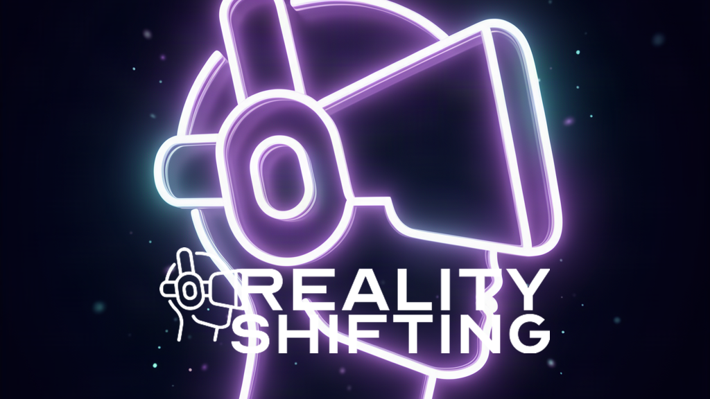

  

  <b>Your full-service tech department, without the cost of hiring one.</b> 
  Websites &nbsp;·&nbsp; Mobile Apps &nbsp;·&nbsp; AI &nbsp;·&nbsp; Automation &nbsp;·&nbsp; Marketing Systems &nbsp;·&nbsp; Tech Support

  
  
  
  

---

## 🚀 Who We Are

Reality Shifting Tech is a lean, AI-augmented build shop in Philadelphia. We design brand systems, ship websites and mobile products, and wire AI workflows into companies that would rather move than manage a vendor stack. Solo creators to national sports and media brands: same principle at every size, remove the manual step, keep the human judgment.

We open-source the tools we use internally, because the best way to prove a product works is to run your own business on it.

## 🧰 What We Build

<table align="center">
  <tr>
    <td align="center" width="50%" style="border: 1px solid #e1e4e8; border-radius: 8px; padding: 12px;">
      <b>🎨 Branding</b> Identity systems, style guides, and visual direction that hold up across every surface.
    </td>
    <td align="center" width="50%" style="border: 1px solid #e1e4e8; border-radius: 8px; padding: 12px;">
      <b>🌐 Websites</b> Fast, conversion-focused builds on modern stacks. Dark-mode-native, motion-rich, SEO-clean.
    </td>
  </tr>
  <tr>
    <td align="center" width="50%" style="border: 1px solid #e1e4e8; border-radius: 8px; padding: 12px;">
      <b>📱 Mobile Apps</b> iOS and Android products designed, built, and shipped to the stores.
    </td>
    <td align="center" width="50%" style="border: 1px solid #e1e4e8; border-radius: 8px; padding: 12px;">
      <b>🤖 AI & Automation</b> Custom agents, agent-native tooling, and workflows that make small teams run like big ones.
    </td>
  </tr>
  <tr>
    <td align="center" width="50%" style="border: 1px solid #e1e4e8; border-radius: 8px; padding: 12px;">
      <b>📣 Social Media</b> Content systems, growth engines, and paid campaigns with the numbers to prove it.
    </td>
    <td align="center" width="50%" style="border: 1px solid #e1e4e8; border-radius: 8px; padding: 12px;">
      <b>🛠️ Tech Support</b> Managed infrastructure and operations, so your team ships instead of firefighting.
    </td>
  </tr>
</table>

## ⭐ Open Source

We ship what we use. Every repo below runs real workloads in production.

<table align="center">
  <tr>
    <td width="50%" style="border: 1px solid #e1e4e8; border-radius: 8px; padding: 14px;">
      <a href="https://github.com/Reality-Shifting-Tech/mailpelican"><b>📬 mailpelican</b></a> 
      Open-source, self-hostable, agent-native email marketing platform.  
      
      
      
    </td>
    <td width="50%" style="border: 1px solid #e1e4e8; border-radius: 8px; padding: 14px;">
      <a href="https://github.com/Reality-Shifting-Tech/deepsight"><b>👁️ deepsight</b></a> 
      Vision-session proxy for text-only LLMs. Sketch + targeted look/zoom/ocr tool calls.  
      
      
      
    </td>
  </tr>
  <tr>
    <td width="50%" style="border: 1px solid #e1e4e8; border-radius: 8px; padding: 14px;">
      <a href="https://github.com/Reality-Shifting-Tech/img2person"><b>🧍 img2person</b></a> 
      One photo in, photoreal 3D person out. Self-hostable, quality-gated.  
      
      
      
    </td>
    <td width="50%" style="border: 1px solid #e1e4e8; border-radius: 8px; padding: 14px;">
      <a href="https://github.com/Reality-Shifting-Tech/OpenMeerkat"><b>🐺 OpenMeerkat</b></a> 
      Open-source omnichannel chatbot platform: inbox, flow builder, AI agents, webhooks, MCP.  
      
      
      
    </td>
  </tr>
</table>

## 🛠️ Stack

  
  
  
  
  
  
  
  
  
  

## 📬 Get In Touch

  <a href="https://realityshiftingtech.com"><b>🌐 realityshiftingtech.com</b></a> &nbsp;·&nbsp;
  <a href="mailto:contact@eliasstevenson.com"><b>📧 contact@eliasstevenson.com</b></a> &nbsp;·&nbsp;
  <a href="https://realityshiftingtech.com"><b>📰 The Shift Report</b></a>

  Built in Philadelphia. © 2026 Reality Shifting Tech. All rights reserved.

